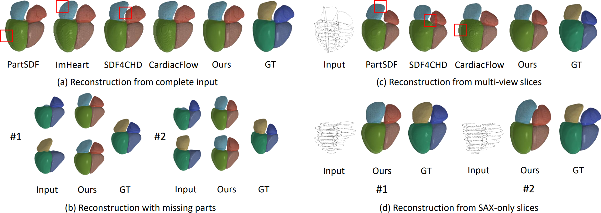

# VecHeart

By [Yihong Chen](https://scalsol.github.io/), [Pascal Fua](https://scholar.google.com/citations?user=kzFmAkYAAAAJ&hl=en).

This repo is an official implementation of the paper "[VecHeart: Holistic Four-Chamber Cardiac Anatomy Modeling via Hybrid VecSets](https://arxiv.org/abs/2604.19403)" accepted by MICCAI 2026.

## Introduction

Accurate cardiac anatomy modeling requires handling the intricate interrelations among the heart's structures, and VecHeart is a unified framework for holistic reconstruction and generation of four-chamber cardiac anatomy.



## Installation

Please refer to [INSTALL.md](INSTALL.md) for installation instructions.

## Data

We provide the curated 4-chamber cardiac mesh dataset at [Google Drive](https://drive.google.com/file/d/1_8NGLGl96z7YBmb19cGIlmNK0wIt55Gy/view?usp=sharing). All cardiac meshes are registered to a common reference frame. Please place (or symlink) the downloaded data under the `data/` folder, then run the following preprocessing script in order to generate the spatial sample points and signed distance fields:

```bash
python tools/preprocess/sdf_generation.py      # generate the SDF data
python tools/preprocess/generate_slice_pts.py  # generate the multi-view slice points
python tools/preprocess/volume_generation.py   # (optional, need GPU) generate the volume data. It is only used for volume IoU evaluation
```

After preprocessing, the `data/` folder will be structured as follows:

```
data/
└── VHMesh/
    ├── VHMesh_0001/                    # one folder per sample
    │   ├── VHMesh_0001_1.obj           # 1 = MYO-LV, 2 = LV, 3 = RV, 4 = LA, 5 = RA
    │   ├── VHMesh_0001_2.obj
    │   ├── VHMesh_0001_3.obj
    │   ├── VHMesh_0001_4.obj
    │   ├── VHMesh_0001_5.obj
    │   ├── VHMesh_0001_sdf.npz         # per-part SDF samples       
    │   ├── VHMesh_0001_slice_pts.npz   # 2D multi-view slice contours         
    │   ├── VHMesh_0001_volume.npz      # voxel label volume, for Volume-IoU   
    │   ├── VHMesh_0001_volume.nii.gz   # same volume as NIfTI, for inspection
    │   └── slice_pts/                  # slice point clouds (visualization only)
    │       ├── 4CH.obj
    │       ├── 3CH.obj
    │       ├── 2CH.obj
    │       └── SAX.obj
    ├── VHMesh_0002/
    │   └── ...
    └── VHMesh_1072/
        └── ...
```

**Note**: All meshes are kept at their original (world) size on disk. Before sampling points, however, each mesh is first normalized into the cube $[-1, 1]^3$ by a fixed shift and scale:

$$p_{\text{norm}} = (p_{\text{world}} - \text{shift}) \times \text{scale}, \qquad \text{shift} = (13.5997,\ 9.3158,\ -1.0133), \qquad \text{scale} = \tfrac{1}{100}.$$

Reconstruction is therefore carried out in this normalized space. When reporting metrics in world units (e.g. Chamfer distance in mm²), remember to undo the scale — for instance by passing `cham_dis_scale` to `tools/test.py`.

Our dataset is curated from multiple sources [1-7]. If you find these data helpful, please remember to cite them.

1. Zeng, A., Wu, C., Lin, G. et al.: Imagecas: A large-scale dataset and benchmark for coronary artery segmentation based on computed tomography angiography images. CMIG (2023)
2. Hansen, B., Pedersen, J., Kofoed, K.F. et al.: A public cardiac ct dataset featuring the left atrial appendage. In: STACOM (2025)
3. Zhuang, X., Li, L., Payer, C. et al.: Evaluation of algorithms for multi-modality whole heart segmentation: an open-access grand challenge. MIA (2019)
4. Metz, C., Schaap, M., Weustink, A. et al.: Coronary centerline extraction from ct coronary angiography images using a minimum cost path approach. Medical physics (2009)
5. chaap, M., Metz, C.T., van Walsum, T. et al.: Standardized evaluation methodology and reference database for evaluating coronary artery centerline extraction algorithms. MIA (2009)
6. Kirişli, H., Schaap, M., Metz, C. et al.: Standardized evaluation framework for evaluating coronary artery stenosis detection, stenosis quantification and lumen segmentation algorithms in computed tomography angiography. MIA (2013)
7. Tobon-Gomez, C., Geers, A.J., Peters, J. et al.: Benchmark for algorithms segmenting the left atrium from 3d ct and mri datasets. TMI (2015)

## Get Started

### Train

```bash
# python tools/train.py <config>
python tools/train.py vecheart.py
```

### Test / Evaluate

```bash
# python tools/test.py <config> <checkpoint> --eval
python tools/test.py vecheart.py work_dirs/vecheart/latest.pth --eval
```

### Inference / Visualization

```bash
python tools/test.py <config> <checkpoint> --show --show-dir <output_dir>
```

Configs live under [configs/](configs/). The provided official configs are explained below:
- [VecHeartACM](configs/vecheart_acm.py) is our full setting.
- [VecHeart](configs/vecheart.py) is trained without ACM, so it can't generalize to missing-part input.
- [VecHeartSliceClean](configs/slices/vecheart_slice.py) is trained on complete synthesized 2CH, 4CH, SAX slice points.
- [VecHeartSliceViewDrop](configs/slices/vecheart_slice_vd.py) randomly drops some views during training, so it can perform inference with an arbitrary combination of views.
- [VecHeartSliceViewDropMotionCorrupt](configs/slices/vecheart_slice_vd_mc.py) additionally introduces the effect of motion corruption on top of the former.

The five configs above are thin leaves that compose shared building blocks from [configs/_base_/](configs/_base_/) (`models/`, `datasets/`, `default_runtime.py`) via the `_base_` inheritance mechanism and override only what differs. If you want to modify something, simply add new models, datasets, metrics and register them, then create a new config — inherit the relevant `_base_` pieces and override the keys you need — and you are ready to go.

**Note:** For the slice-based models, train [VecHeartACM](configs/vecheart_acm.py) model first.

**Note:** The results you obtained may differ from the paper a bit. That's expected as we change the dataset processing flow for public release.

## Acknowledgement

Thanks to these great repositories: [mmcv](https://github.com/open-mmlab/mmcv), [VecSetX](https://github.com/1zb/VecSetX/), [sdf_gen](https://github.com/1zb/sdf_gen).

## Citation

If you find this work useful in your research, please consider citing:

```bibtex
@article{chen2025tetheart,
  title   = {VecHeart: Holistic Four-Chamber Cardiac Anatomy Modeling via Hybrid VecSets},
  author  = {Chen, Yihong and Fua, Pascal},
  journal = {MICCAI},
  year    = {2026}
}
```
